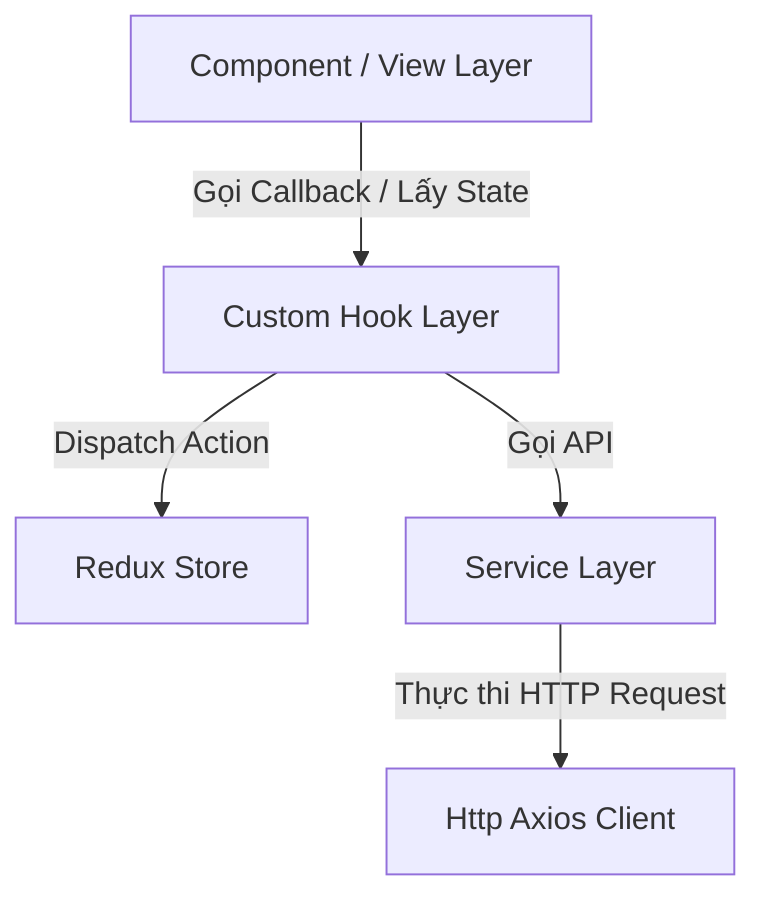

# HƯỚNG DẪN CẤU TRÚC CODE & PHÁT TRIỂN DỰ ÁN
*(PROJECT CODING & DIRECTORY STRUCTURE GUIDE)*

Tài liệu này hướng dẫn chi tiết về cấu trúc thư mục, quy trình viết code, cách gọi API, quản lý state và các tiêu chuẩn UI/UX của dự án. Vui lòng tuân thủ nghiêm ngặt các quy tắc này để đảm bảo code sạch, nhất quán và dễ bảo trì.

---

## 1. CẤU TRÚC THƯ MỤC DỰ ÁN (DIRECTORY STRUCTURE)

Dự án được cấu trúc theo định hướng mô-đun và phân chia trách nhiệm rõ ràng (Separation of Concerns).

```text
src/
├── assets/             # Tài nguyên tĩnh (Hình ảnh, SVG, biểu tượng tĩnh...)
├── common/             # Các hằng số toàn cục dùng chung cho dự án
│   └── constants.ts    # Khai báo API endpoints, Auth token key...
├── components/         # Các Component giao diện tái sử dụng
│   ├── ui/             # Các Component nguyên bản của shadcn/ui (KHÔNG sửa thủ công)
│   └── <feature>/      # Component tái sử dụng trong phạm vi một Feature (vd: post/CommentCard.tsx)
├── data/               # Dữ liệu tĩnh hoặc Mock dữ liệu cho phát triển UI
│   └── mock/           # Các file mock dữ liệu (.ts) phục vụ chạy offline/test
├── hooks/              # Custom Hooks chứa logic nghiệp vụ và tương tác Store/Service
├── lib/                # Cấu hình các thư viện cốt lõi toàn hệ thống
│   ├── http.ts         # Wrapper Axios tùy chỉnh (Xử lý Refresh Token, Interceptors...)
│   └── utils.ts        # Helper ghép class CSS (Tailwind Merge + Clsx)
├── plugins/            # Cấu hình dịch vụ bên thứ ba (Firebase, Router, v.v.)
│   └── routers/        # Định tuyến (React Router v7)
├── services/           # Lớp Service tương tác API trực tiếp
├── stores/             # Quản lý State toàn cục (Redux Toolkit)
├── types/              # Các định nghĩa kiểu dữ liệu TypeScript (Interfaces, Types)
│   ├── base/           # Các base interface và base class (BaseService.ts, IBase.tsx)
│   └── interfaces/     # Các Interface chi tiết cho từng đối tượng (auth, post, result...)
├── utils/              # Các hàm bổ trợ xử lý chuỗi, định dạng, điều hướng...
├── views/              # Các trang cấp tuyến (Route-level pages)
│   └── <feature>/      # Các Page cụ thể của từng module (vd: home/Home.tsx, auth/Login.tsx)
│       └── partials/   # Các trang con hoặc tab lồng bên trong View chính đó
├── App.tsx             # Component gốc của App, chứa RouterProvider
└── main.tsx            # Điểm đầu vào (Vite Entrypoint), chứa Redux Provider và CSS Imports
```

---

## 2. KIẾN TRÚC 3 LỚP (SERVICE ➔ HOOK ➔ VIEW)
Dự án áp dụng nghiêm ngặt kiến trúc 3 lớp nhằm tách biệt phần xử lý giao diện và phần xử lý logic/gọi API.



### 🎯 Nguyên tắc hoạt động của 3 lớp:
1. **Lớp Service (`src/services/`)**:
   - **Trách nhiệm**: Gọi API bằng Axios wrapper (`http`), trả về dữ liệu thô từ Server hoặc Boolean trạng thái.
   - **Quy tắc**: Rất mỏng, không có logic nghiệp vụ React, không gọi Hooks, không tương tác với Redux Store.
   
2. **Lớp Hook (`src/hooks/`)**:
   - **Trách nhiệm**: Chứa toàn bộ logic nghiệp vụ (business logic) của React. Gọi Service, lưu trữ state cục bộ (`useState`) hoặc dispatch lên Redux Store, xử lý lỗi (hiển thị thông báo Toast thông qua `sonner`), điều hướng trang (`useNavigate`).
   - **Quy tắc**: Trả về một Object chứa các biến trạng thái (loading, data, error) và các hàm callback để UI kích hoạt.

3. **Lớp View/Component (`src/views/` hoặc `src/components/`)**:
   - **Trách nhiệm**: Chỉ hiển thị giao diện (presentation) và nhận sự kiện từ người dùng.
   - **Quy tắc**: **KHÔNG** import trực tiếp `useSelector`, `useDispatch` từ Redux, **KHÔNG** import trực tiếp API Service. Tất cả dữ liệu và hành động phải lấy từ Custom Hook của lớp số 2.

---

## 3. HỆ THỐNG GỌI API (HTTP & API LAYER)

### A. HTTP Client (`src/lib/http.ts`)
Là một lớp Wrapper cho `Axios` giúp tự động cấu hình và tối ưu hóa xử lý lỗi:
* **Tự động gắn Token**: Tự động chèn `Authorization: Bearer <access_token>` từ `localStorage` vào Header của mỗi Request.
* **Cơ chế Auto Refresh Token (401)**: Khi API trả về `401 Unauthorized`, client sẽ tạm ngưng các request khác, gọi ngầm API Refresh Token `/api/auth/refresh-token` để lấy Access Token mới, lưu lại vào LocalStorage và thực thi lại toàn bộ các request đã bị tạm giữ trước đó. Nếu refresh thất bại, xóa token và tự động chuyển hướng về trang `/login`.
* **Xử lý Cấm truy cập (403)**: Tự động phát hiện lỗi `403 Forbidden`, lưu giữ đường dẫn hiện tại vào `localStorage` dưới tên `"PATH"`, hiển thị thông báo lỗi bằng Toast và chuyển hướng người dùng về trang đăng nhập.

#### 💡 Bảng so sánh các phương thức trong `http` (Tất cả trả trực tiếp data `T`, không cần `.data` của Axios):
| Phương thức | Chữ ký phương thức (Signature) | Ghi chú |
|---|---|---|
| `get` | `get<T>(url, params?, config?)` | Query params truyền dưới dạng object |
| `post` | `post<T>(url, data?, config?)` | JSON body gửi lên server |
| `put` | `put<T>(url, data, config?)` | Cập nhật tài nguyên bằng JSON body |
| `delete` | `delete<T>(url, config?)` | Xóa tài nguyên |
| `deleteWithBody` | `deleteWithBody<T>(url, data)` | DELETE gửi kèm dữ liệu trong Body |
| `postWithFile` | `postWithFile<T>(url, data)` | Upload file, Header mặc định là `multipart/form-data` |
| `ExportFile` | `ExportFile<T>(url)` | GET tải file, responseType là `blob` |
| `ExportFileWithData`| `ExportFileWithData<T>(url, data[])`| POST gửi dữ liệu kèm tải file dạng `blob` |

---

### B. Base Service (`src/types/base/BaseService.ts`)
Là một lớp trừu tượng (Abstract Class) mà mọi Class Service trong dự án đều kế thừa. Nó cung cấp sẵn các phương thức CRUD cơ bản:

```typescript
class BaseService {
  async getList<T>(url: string, id?: string | number, params?: QueryParams): Promise<Array<T>>
  async getSingle<T>(url: string, id?: string | number, params?: QueryParams): Promise<T | null>
  async create<T, TData = any>(url: string, data: TData): Promise<boolean>
  async createAndGetData<T, TData = any>(url: string, data: TData): Promise<T | null>
  async update<T, TData = any>(url: string, data: TData): Promise<boolean>
  async updateAndGetData<T, TData = any>(url: string, data: TData): Promise<T | null>
  async delete(url: string, id: Array<string> | Array<number>): Promise<boolean>
  async deleteWithBody<T>(url: string, data: T): Promise<boolean>
}
```

> [!IMPORTANT]
> Mọi hàm của `BaseService` đều đã tự động bóc tách và trả về trường `.data` của `ApiResultGeneric<T>`. Bạn **KHÔNG** được truy cập trường `.data` thủ công khi nhận phản hồi từ các hàm kế thừa của `BaseService`.

---

## 4. HƯỚNG DẪN TỪNG BƯỚC VIẾT FEATURE MỚI (VÍ DỤ CỤ THỂ)

Giả sử chúng ta cần viết một tính năng mới: **"Bình luận bài viết" (Comments)**. Chúng ta sẽ đi qua 6 bước chuẩn mực:

### BƯỚC 1: Đăng ký API Endpoint (`src/common/constants.ts`)
Thêm đường dẫn API của Feature vào đối tượng `API`. Tuyệt đối không hardcode chuỗi API trong các Service.

```typescript
// src/common/constants.ts
export const API = {
  // ... các API khác
  COMMENT: {
    BASE: "users/comments",             // API CRUD cho comment
    BY_POST: "users/comments/post",     // API lấy danh sách bình luận theo postId
  }
};
```

---

### BƯỚC 2: Định nghĩa các Kiểu dữ liệu (Interfaces) trong `src/types/`
Tạo các Interface quy chuẩn cho dữ liệu gửi đi và nhận về từ API.

```typescript
// src/types/interfaces/comment/IComment.ts
import type { IBase } from "@/types/base/IBase";
import type { IAuthor } from "@/types/interfaces/user/IAuthor";

export interface IComment extends IBase {
  postId: number;
  author: IAuthor;
  content: string;
  createdAt: string;
  likeCount: number;
}

export interface ICommentCreate {
  postId: number;
  content: string;
}
```

---

### BƯỚC 3: Tạo lớp Service (`src/services/commentService.ts`)
Tạo Service kế thừa từ `BaseService`. Nếu chỉ cần các API CRUD cơ bản, lớp Service sẽ cực kỳ gọn nhẹ!

```typescript
// src/services/commentService.ts
import BaseService from "@/types/base/BaseService";
import http from "@/lib/http";
import { API } from "@/common/constants";
import type { ApiResultGeneric } from "@/types/interfaces/result/apiResult";
import type { IComment } from "@/types/interfaces/comment/IComment";

export class CommentService extends BaseService {
  // Vì BaseService đã có getList, create, update, delete... ta chỉ cần viết thêm hàm tùy chỉnh nếu có endpoint đặc biệt:
  async getCommentsByPost(postId: number): Promise<IComment[]> {
    try {
      // Dùng hàm getList kế thừa từ BaseService
      return await this.getList<IComment>(API.COMMENT.BY_POST, postId);
    } catch (error) {
      console.error("Lỗi lấy danh sách bình luận:", error);
      return [];
    }
  }
}

// Export dạng Singleton
export default new CommentService();
```

---

### BƯỚC 4: Tạo Redux Slice (`src/stores/commentSlice.ts`) - Nếu cần quản lý State toàn cục
*Lưu ý: Nếu dữ liệu chỉ dùng cục bộ trong một trang duy nhất, hãy bỏ qua bước này và sử dụng `useState` trực tiếp ở Custom Hook.*

```typescript
// src/stores/commentSlice.ts
import { createSlice, PayloadAction } from "@reduxjs/toolkit";
import type { IComment } from "@/types/interfaces/comment/IComment";

interface CommentState {
  commentsByPost: Record<number, IComment[]>;
  isLoading: boolean;
}

const initialState: CommentState = {
  commentsByPost: {},
  isLoading: false,
};

const commentSlice = createSlice({
  name: "comment",
  initialState,
  reducers: {
    setCommentsForPost: (state, action: PayloadAction<{ postId: number; comments: IComment[] }>) => {
      const { postId, comments } = action.payload;
      state.commentsByPost[postId] = comments;
    },
    addCommentToPost: (state, action: PayloadAction<IComment>) => {
      const comment = action.payload;
      if (!state.commentsByPost[comment.postId]) {
        state.commentsByPost[comment.postId] = [];
      }
      state.commentsByPost[comment.postId].unshift(comment); // Đẩy bình luận mới lên đầu
    },
    setIsLoading: (state, action: PayloadAction<boolean>) => {
      state.isLoading = action.payload;
    }
  }
});

export const commentActions = commentSlice.actions;
export default commentSlice.reducer;
```

*Đăng ký slice này vào `src/stores/store.ts` nếu cần.*

---

### BƯỚC 5: Viết Custom Hook (`src/hooks/useComment.tsx`)
Đây là nơi chứa toàn bộ logic nghiệp vụ. Custom Hook kết nối UI với Service và Redux Store.

```typescript
// src/hooks/useComment.tsx
import { useState } from "react";
import { useDispatch, useSelector } from "react-redux";
import type { RootState, AppDispatch } from "@/stores/store";
import { commentActions } from "@/stores/commentSlice";
import commentService from "@/services/commentService";
import type { ICommentCreate, IComment } from "@/types/interfaces/comment/IComment";
import { API } from "@/common/constants";
import { toast } from "sonner";

export function useComment(postId: number) {
  const dispatch: AppDispatch = useDispatch();
  
  // Lấy dữ liệu từ Redux Store
  const comments = useSelector((state: RootState) => state.comment.commentsByPost[postId] || []);
  const isLoading = useSelector((state: RootState) => state.comment.isLoading);
  
  // State cục bộ phục vụ việc gửi bình luận
  const [isSubmitting, setIsSubmitting] = useState(false);

  // 1. Hàm tải danh sách bình luận
  async function fetchComments() {
    dispatch(commentActions.setIsLoading(true));
    try {
      const data = await commentService.getCommentsByPost(postId);
      dispatch(commentActions.setCommentsForPost({ postId, comments: data }));
    } catch (error) {
      toast.error("Không thể tải bình luận");
    } finally {
      dispatch(commentActions.setIsLoading(false));
    }
  }

  // 2. Hàm gửi bình luận mới
  async function createComment(content: string) {
    if (!content.trim()) {
      toast.warning("Nội dung bình luận không được để trống");
      return false;
    }

    setIsSubmitting(true);
    try {
      const data: ICommentCreate = { postId, content };
      // Gọi API createAndGetData của BaseService qua commentService
      const newComment = await commentService.createAndGetData<IComment>(API.COMMENT.BASE, data);
      
      if (newComment) {
        dispatch(commentActions.addCommentToPost(newComment));
        toast.success("Đã đăng bình luận");
        return true;
      }
      return false;
    } catch (error) {
      toast.error("Lỗi khi đăng bình luận");
      return false;
    } finally {
      setIsSubmitting(false);
    }
  }

  return {
    comments,
    isLoading,
    isSubmitting,
    fetchComments,
    createComment,
  };
}
```

---

### BƯỚC 6: Tạo Component Giao diện (`src/components/post/CommentSection.tsx`)
Nhận sự kiện người dùng và hiển thị dữ liệu thô. **Lớp này cực kỳ tối giản về mặt logic.**

```typescript
// src/components/post/CommentSection.tsx
import { useEffect, useState } from "react";
import { useComment } from "@/hooks/useComment";
import { Button } from "@/components/ui/button";
import { Input } from "@/components/ui/input";
import { Spinner } from "@/components/ui/spinner";

interface CommentSectionProps {
  postId: number;
}

export default function CommentSection({ postId }: CommentSectionProps) {
  const { comments, isLoading, isSubmitting, fetchComments, createComment } = useComment(postId);
  const [text, setText] = useState("");

  // Gọi tải bình luận khi mount component
  useEffect(() => {
    fetchComments();
  }, [postId]);

  const handleSubmit = async () => {
    const success = await createComment(text);
    if (success) {
      setText(""); // Xóa trắng ô nhập liệu khi thành công
    }
  };

  return (
    <div className="mt-4 space-y-4 rounded-xl border border-border bg-card p-4">
      <h3 className="font-semibold text-foreground">Bình luận ({comments.length})</h3>
      
      {/* Khung nhập bình luận */}
      <div className="flex gap-2">
        <Input
          placeholder="Viết bình luận..."
          value={text}
          onChange={(e) => setText(e.target.value)}
          onKeyDown={(e) => {
            if (e.key === "Enter") handleSubmit();
          }}
          disabled={isSubmitting}
        />
        <Button onClick={handleSubmit} disabled={isSubmitting}>
          {isSubmitting ? <Spinner /> : "Gửi"}
        </Button>
      </div>

      {/* Hiển thị danh sách bình luận */}
      {isLoading ? (
        <div className="flex justify-center py-4">
          <Spinner />
        </div>
      ) : (
        <div className="max-h-60 overflow-y-auto space-y-3">
          {comments.map((comment) => (
            <div key={comment.id} className="text-sm p-2 rounded-lg bg-muted/40">
              <div className="flex justify-between items-center mb-1">
                <span className="font-semibold text-primary">{comment.author.userName}</span>
                <span className="text-xs text-muted-foreground">{new Date(comment.createdAt).toLocaleDateString("vi-VN")}</span>
              </div>
              <p className="text-foreground">{comment.content}</p>
            </div>
          ))}
          {!isLoading && comments.length === 0 && (
            <p className="text-sm text-center text-muted-foreground py-2">Hãy là người đầu tiên bình luận!</p>
          )}
        </div>
      )}
    </div>
  );
}
```

---

## 5. CÁC QUY TẮC PHÁT TRIỂN UI & STYLING

Dự án ưu tiên giao diện hiện đại, mượt mà và trực quan với các tiêu chí thiết kế cao cấp:

1. **CSS & Styling System**:
   - Sử dụng **Tailwind CSS v4** thông qua bộ tiền xử lý `@tailwindcss/vite`. Không tạo hoặc chỉnh sửa file `tailwind.config` riêng lẻ.
   - Toàn bộ biến CSS Token (colors, borders, fonts) được khai báo tại `src/index.css`.
   
2. **Hệ thống Font & Chữ (Typography)**:
   - Các font chữ được cài đặt sẵn bao gồm: `@fontsource-variable/inter` (mặc định), `figtree`, `noto-sans`, và `playfair-display`. Tất cả đều được import tập trung trong file `src/index.css`.

3. **Nguyên tắc chọn Icon (Biểu tượng)**:
   - Sử dụng thư viện `@hugeicons/react` làm thư viện chính (Primary) cho giao diện.
   - Thư viện `lucide-react` là thư viện phụ (Secondary) chỉ dùng cho các trường hợp tương thích với Shadcn/ui.

4. **Trải nghiệm Đa thiết bị (Responsive)**:
   - Sử dụng Custom Hook `useMobile()` được khai báo trong `src/hooks/use-mobile.ts` để kiểm tra độ rộng màn hình và thực hiện hiển thị Layout thông minh cho điện thoại di động.
   - Thiết lập giao diện linh hoạt dựa trên các class Tailwind như `grid`, `flex`, `hidden lg:flex`.

5. **Toast & Thông báo (Sonner)**:
   - Mọi thông báo thành công, cảnh báo hoặc lỗi bắt buộc phải thông qua thư viện `toast` trong package `sonner` (như đã demo ở Custom Hook).

---

## 6. DANH SÁCH CHECKLIST KHI REVIEW CODE
Trước khi submit code mới hoặc tạo Pull Request, vui lòng kiểm tra nhanh danh sách sau:
* [ ] Component View không dùng trực tiếp `useSelector` / `useDispatch` hoặc import API Service?
* [ ] Tên file component và thư mục có định dạng PascalCase (vd: `FriendsSidebar.tsx`)?
* [ ] Tất cả các API URL đều được định nghĩa trong `src/common/constants.ts` (không hardcode)?
* [ ] Lớp Service đã kế thừa đúng `BaseService` chưa? Có bị bóc tách `.data` thừa không?
* [ ] Có dùng đúng Icon của `@hugeicons/react` không?
* [ ] Đã khai báo đầy đủ kiểu dữ liệu tường minh (không sử dụng kiểu `any` bừa bãi)?
* [ ] Ngôn ngữ hiển thị trên giao diện người dùng có hoàn toàn bằng **tiếng Việt** hay không?
